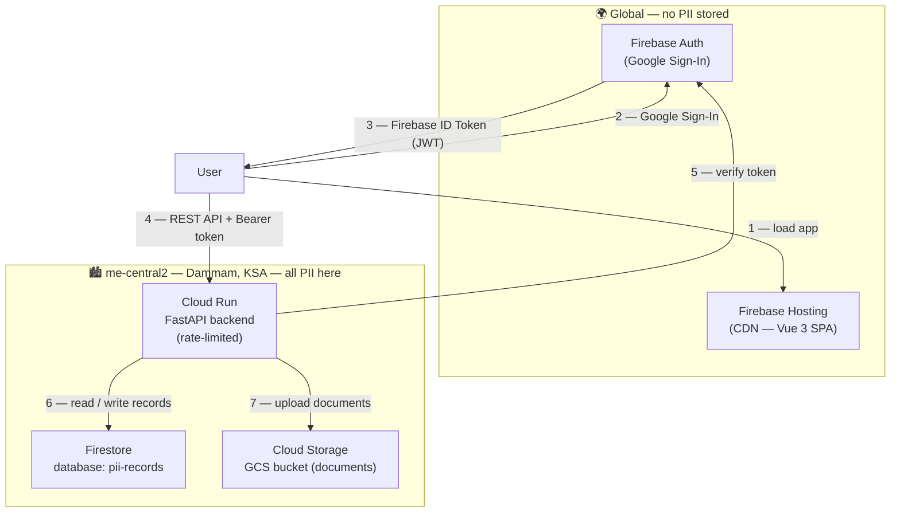
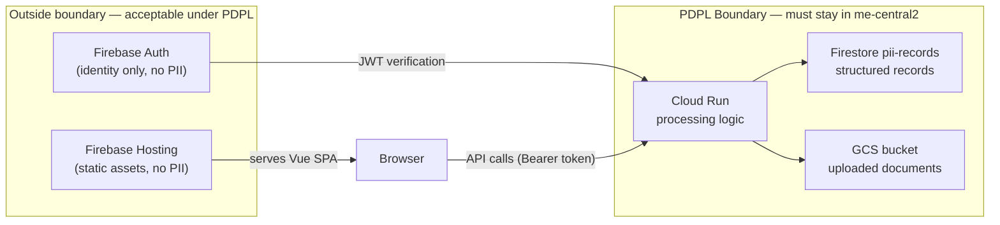
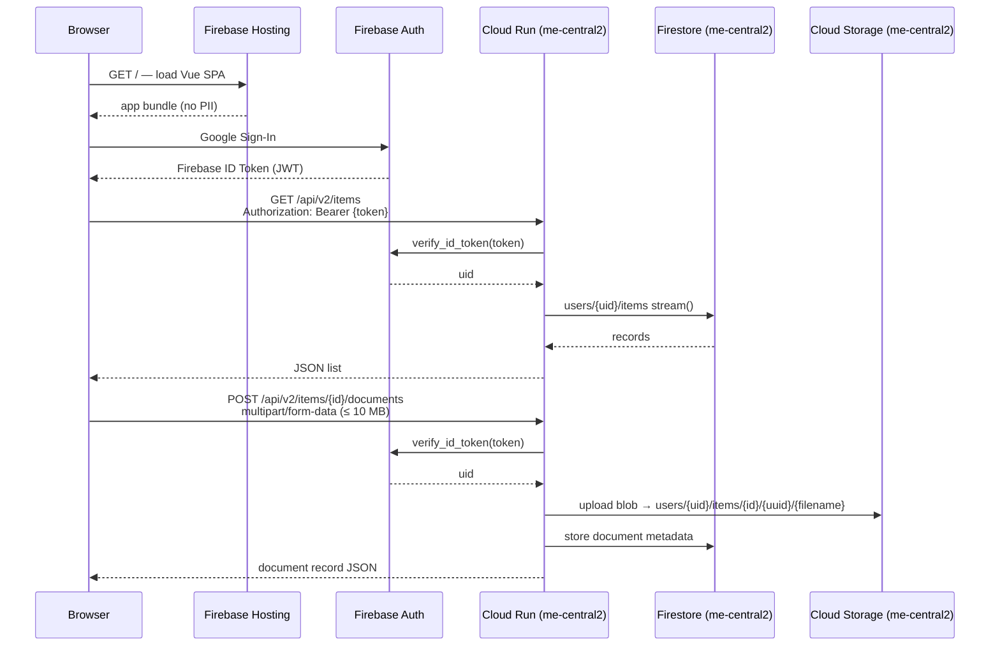

# KSA Sovereign Data Portal

A reference implementation for PII-handling web applications that comply with the **KSA Personal Data Protection Law (PDPL)**. All customer data and processing remain within the **me-central2 (Dammam)** Google Cloud region. Identity is handled by Firebase Auth (globally acceptable — no PII is stored there).

---

## Architecture



---

## Data Residency

The KSA PDPL requires that PII is processed and stored within the Kingdom. This project achieves that through three mechanisms:



| Service | Region | Contains PII? | PDPL status |
|---|---|---|---|
| Firebase Hosting | Global CDN | No — static Vue bundle only | Acceptable |
| Firebase Auth | Global | No — opaque UID + email only | Acceptable |
| Cloud Run (FastAPI) | me-central2 | Processes PII in memory | ✅ In-Kingdom |
| Firestore `pii-records` | me-central2 | Stores all record data | ✅ In-Kingdom |
| Cloud Storage bucket | me-central2 | Stores uploaded documents | ✅ In-Kingdom |

**Firestore regional endpoint** — the backend explicitly routes all Firestore traffic through `firestore.me-central2.rep.googleapis.com:443`. TLS terminates inside the region, satisfying data-in-transit requirements.

---

## Request Flow



---

## Project Structure

```
.
├── main.py                        # FastAPI backend (v1 HTMX + v2 JSON endpoints)
├── requirements.txt               # Python dependencies
├── firebase.json                  # Firebase Hosting multi-site config
├── .env.example                   # Backend environment variable template
├── public/
│   └── index.html                 # Legacy HTMX frontend
└── vue-app/                       # Vue 3 SPA
    ├── src/
    │   ├── App.vue                # Auth gate + layout
    │   ├── firebase.js            # Firebase SDK init (env vars only)
    │   ├── composables/
    │   │   ├── useAuth.js         # Firebase onAuthStateChanged wrapper
    │   │   └── useApi.js          # REST API calls with Bearer token
    │   └── components/
    │       ├── LoginView.vue      # Google sign-in button
    │       ├── RecordForm.vue     # Create a new record
    │       ├── RecordList.vue     # List records + expand documents
    │       └── DocumentUpload.vue # Upload files per record
    ├── .env.example               # Vue environment variable template
    └── vite.config.js
```

---

## Prerequisites

- GCP project with **Firebase enabled**
- `gcloud` CLI authenticated: `gcloud auth login`
- `firebase` CLI installed and authenticated:
  ```bash
  npm install -g firebase-tools
  firebase login
  ```
- APIs enabled on your GCP project:
  ```bash
  gcloud services enable run.googleapis.com firestore.googleapis.com \
    storage.googleapis.com firebase.googleapis.com --project YOUR_PROJECT_ID
  ```

---

## Setup

### 1 — Firestore named database

Create a **named** database in Dammam (not the default `(default)` database — the named database keeps PII isolated):

```bash
gcloud firestore databases create \
  --database=pii-records \
  --location=me-central2 \
  --type=firestore-native \
  --project=YOUR_PROJECT_ID
```

### 2 — Cloud Storage bucket

Create the document storage bucket pinned to Dammam:

```bash
gcloud storage buckets create gs://YOUR_BUCKET_NAME \
  --location=me-central2 \
  --project=YOUR_PROJECT_ID
```

### 3 — IAM permissions

Grant the Cloud Run service account access to Firestore and GCS:

```bash
PROJECT_NUMBER=$(gcloud projects describe YOUR_PROJECT_ID --format='value(projectNumber)')
SA="${PROJECT_NUMBER}-compute@developer.gserviceaccount.com"

# Firestore read/write
gcloud projects add-iam-policy-binding YOUR_PROJECT_ID \
  --member="serviceAccount:${SA}" \
  --role="roles/datastore.user"

# GCS object write
gcloud storage buckets add-iam-policy-binding gs://YOUR_BUCKET_NAME \
  --member="serviceAccount:${SA}" \
  --role="roles/storage.objectAdmin"
```

### 4 — Firebase Hosting multi-site targets

```bash
firebase target:apply hosting htmx-app YOUR_HTMX_SITE_ID --project YOUR_PROJECT_ID
firebase target:apply hosting vue-app  YOUR_VUE_SITE_ID  --project YOUR_PROJECT_ID
```

### 5 — Backend environment variables

Copy `.env.example` and fill in your values:

```bash
cp .env.example cloudrun-env.yaml
```

Edit `cloudrun-env.yaml`:

```yaml
GCS_BUCKET: your-bucket-name
CORS_ORIGINS: "https://YOUR_PROJECT_ID.web.app,https://YOUR_PROJECT_ID.firebaseapp.com,https://YOUR_VUE_SITE_ID.web.app"
```

> `cloudrun-env.yaml` is in `.gitignore` — never commit it.

### 6 — Vue app environment variables

```bash
cp vue-app/.env.example vue-app/.env.local
```

Edit `vue-app/.env.local`:

```env
VITE_BACKEND_URL=https://YOUR_CLOUD_RUN_URL.me-central2.run.app
VITE_FIREBASE_API_KEY=your-api-key
VITE_FIREBASE_AUTH_DOMAIN=YOUR_PROJECT_ID.firebaseapp.com
VITE_FIREBASE_PROJECT_ID=YOUR_PROJECT_ID
VITE_FIREBASE_STORAGE_BUCKET=YOUR_PROJECT_ID.firebasestorage.app
VITE_FIREBASE_MESSAGING_SENDER_ID=YOUR_PROJECT_NUMBER
VITE_FIREBASE_APP_ID=your-app-id
```

Find these values in: **Firebase Console → Project Settings → Your apps → SDK setup and configuration**.

> `vue-app/.env.local` is in `.gitignore` — never commit it.

---

## Local Development

### Backend

```bash
pip install -r requirements.txt

# Set required env vars for local runs
export GCS_BUCKET=your-bucket-name
export CORS_ORIGINS=http://localhost:5173

uvicorn main:app --reload --port 8080
```

### Frontend

```bash
cd vue-app
npm install
npm run dev        # starts at http://localhost:5173
```

### Tests

```bash
# Backend tests
pytest tests/ -v

# Vue tests
cd vue-app && npm run test
```

---

## Deployment

Create the deploy script from the template (it is gitignored):

```bash
cp .env.example deploy.sh   # or create manually — see below
```

The recommended deploy command with all security hardening flags:

```bash
gcloud run deploy dammam-backend \
  --source . \
  --region me-central2 \
  --allow-unauthenticated \
  --env-vars-file cloudrun-env.yaml \
  --max-instances 10 \
  --concurrency 80 \
  --timeout 30 \
  --cpu-throttling \
  --project YOUR_PROJECT_ID
```

**Flag explanations:**

| Flag | Value | Purpose |
|---|---|---|
| `--max-instances` | 10 | Hard cap on scaling — limits blast radius if the URL is flooded |
| `--timeout` | 30s | Kills slow requests (default 300s); prevents upload-exhaustion attacks |
| `--concurrency` | 80 | Explicit: each instance handles ≤80 concurrent requests before a new one spawns |
| `--cpu-throttling` | — | CPU throttled when idle — cost reduction |

Deploy the Vue frontend:

```bash
cd vue-app && npm run build && cd ..
firebase deploy --only hosting:vue-app --project YOUR_PROJECT_ID
```

---

## Security

| Layer | Mechanism |
|---|---|
| Authentication | Firebase ID token verified on every request via `firebase_admin.auth.verify_id_token()` |
| Rate limiting | `slowapi` — 60 req/min on reads, 10/min on writes, 5/min on uploads (per IP) |
| 401 responses | Sanitised to `"Unauthorized"` only — no exception class or stack detail returned |
| Upload safety | 10 MB hard limit; filename sanitised via `os.path.basename` + space removal |
| Instance cap | `--max-instances 10` — flood cannot drive unbounded Cloud Run scaling costs |
| Data path isolation | Firestore traffic forced through `firestore.me-central2.rep.googleapis.com:443` |

---

## Compliance Summary

| PDPL Requirement | How it is met |
|---|---|
| Data at rest in KSA | Firestore `pii-records` and GCS bucket both pinned to `me-central2` |
| Data in transit in KSA | Regional Firestore endpoint — TLS terminates inside `me-central2` |
| Processing in KSA | Cloud Run service deployed exclusively to `me-central2` |
| Identity (global acceptable) | Firebase Auth — stores opaque UID only, no PII |
